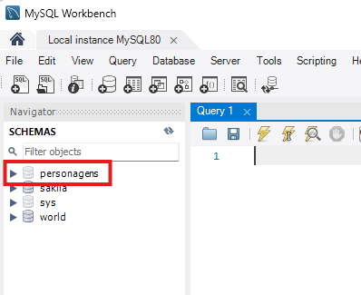
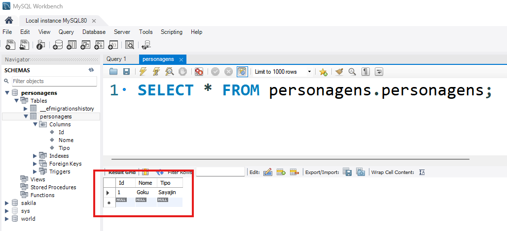

# O que é Mapeamento Objeto-Relacional (ORM)?

O **ORM (Object-Relational Mapping)** permite interagir com um **banco de dados relacional** usando **objetos** em vez de comandos SQL diretos.
No **universo de Dragon Ball**, imagine que o **banco de dados** seja a **Grande Enciclopédia dos Guerreiros Z**, onde estão registradas todas as informações dos personagens.
Cada **personagem** (objeto) tem **atributos** como **nome, nível de poder e raça**. O ORM permite que a gente manipule essas informações sem precisar escrever SQL puro.

### 💻 Exemplo: Criando uma classe `Personagem`

```csharp
public class Personagem
{
    public int Id { get; set; }
    public string Nome { get; set; }
    public string Raca { get; set; }
    public int NivelPoder { get; set; }
}
```

>💡**Essa classe representa a tabela de personagens no banco de dados!**  

# Introdução ao Entity Framework Core

O **Entity Framework Core (EF Core)** é um ORM para .NET que permite interagir com um banco de dados relacional usando **C#**.
Ele traduz operações em **C#** para comandos **SQL** automaticamente.
Assim como o **Goku** precisa do **Ki** para soltar um Kamehameha, o **EF Core** precisa de um **banco de dados** para armazenar os dados.

Para criar um projeto Web API com o **Entity Framework Core**, siga estes passos:  

### 1 - Criar um projeto `webapi` usando ``controllers`

```sh
dotnet new webapi --use-controllers -o ProjetoDBZ
```

### 2 - Instalar o pacote principal do `EF Core` na versão 7.0.7

```sh
dotnet add package Microsoft.EntityFrameworkCore --version 7.0.7
```

### 3 - Instalar o pacote `EF Core Tools` na versão 7.0.7

```sh
dotnet add package Microsoft.EntityFrameworkCore.Tools --version 7.0.7
```

### 4 - Instalar o provedor de banco de dados `MySQL` na versão 7.0.0

```sh
dotnet add package Pomelo.EntityFrameworkCore.MySql --version 7.0.0
```

>Com isso, você pode rodar comandos do EF Core como **migrations** e **database update**.

### 5 - Crie um `Model`

> ➡️ Crie uma pasta chamada `Models` e dentro dela um arquivo chamado `Personagem.cs`

```csharp
namespace ProjetoDBZ.Models
{
    public class Personagem
    {
        public int Id { get; set; }
        public string? Nome { get; set; }
        public string? Tipo { get; set; }
    }
}
```

### 6 - 🎲 Criando o `DbContext`

O **`DbContext`** é a **classe principal do Entity Framework Core**. Ele atua como uma **ponte** entre a aplicação e o banco de dados, permitindo que você consulte, insira, atualize e exclua dados de forma fácil e eficiente (CRUD da alegria 😀).  

Pense no `DbContext` como um **supervisor** que gerencia o fluxo de dados entre o seu código e o banco de dados.  
Ele rastreia todas as entidades (objetos) e sabe quando **salvar mudanças** ou **buscar informações** no banco.  

**Principais Responsabilidades do `DbContext`**
1. **Gerenciar a conexão com o banco de dados**  
2. **Mapear classes do C# para tabelas do banco**  
3. **Realizar operações CRUD (Create, Read, Update, Delete)**  
4. **Rastrear mudanças nos objetos para atualizar o banco automaticamente**  

> ➡️ Crie uma pasta chamada `Data` e dentro dela um arquivo chamado `AppDbContext.cs`

```csharp
using Microsoft.EntityFrameworkCore; // Importa a biblioteca do Entity Framework Core, que permite trabalhar com banco de dados de forma orientada a objetos.
using ProjetoDBZ.Models; // Importa o namespace onde está definida a classe Personagem.

namespace ProjetoDBZ.Data // Define um namespace chamado ProjetoDBZ.Data para organizar o código.
{
    // Definição da classe AppDbContext que herda de DbContext, a classe base do Entity Framework para acessar o banco de dados.
    public class AppDbContext : DbContext
    {
        // Construtor da classe AppDbContext que recebe um objeto do tipo DbContextOptions.
        // Esse objeto contém as configurações do banco de dados e é passado para a classe base (DbContext).
        public AppDbContext(DbContextOptions options) : base(options) {}

        // Propriedade do tipo DbSet<Personagem>, que representa a tabela "Personagens" no banco de dados.
        // O DbSet permite realizar operações como inserção, consulta, atualização e remoção de registros.
        public DbSet<Personagem> Personagens { get; set; }
    }
}
```

>Agora, o EF Core sabe onde armazenar os personagens no banco de dados MySQL!

### 7 - Criando o `Controller`

> ➡️ Dentro da pasta `Controllers` crie um API Controller chamado `PersonagensControllers.cs`


```csharp
using Microsoft.AspNetCore.Mvc;
using ProjetoDBZ.Data;

namespace ProjetoDBZ.Controllers
{
    [ApiController] // Indica que esta classe é um controlador de API.
    [Route("api/[controller]")] // Define a rota base para as requisições HTTP. O "[controller]" será substituído pelo nome da classe sem o sufixo "Controller".
    public class PersonagensController : ControllerBase 
    {
        private readonly AppDbContext _appDbContext; // Declaração de uma variável para acessar o banco de dados.

        // Construtor que recebe uma instância de AppDbContext por injeção de dependência.
        public PersonagensController(AppDbContext appDbContext)
        {
            _appDbContext = appDbContext;
        }
    }
}
```

Após fazer todos os passos anteriores, faça um `build` para verificar se está tudo certo.

```sh
dotnet build
```

### 8 - Criação da conexão do banco de dados no arquivo `appsettings.json`

```json
// {
//   "Logging": {
//     "LogLevel": {
//       "Default": "Information",
//       "Microsoft.AspNetCore": "Warning"
//     }
//   },
//   "AllowedHosts": "*",
  "ConnectionStrings": {
    "AppDbConnectionString": "server=localhost; database=Personagens; User=root; Password=123456;"
  }
// }
```

### 9 - Preparação do arquivo `Program.cs`

```csharp
using Microsoft.EntityFrameworkCore;
using ProjetoDBZ.Data;
// var builder = WebApplication.CreateBuilder(args);

// // Add services to the container.

// builder.Services.AddControllers();
// // Learn more about configuring Swagger/OpenAPI at https://aka.ms/aspnetcore/swashbuckle
// builder.Services.AddEndpointsApiExplorer();
// builder.Services.AddSwaggerGen();

var connectionString = builder.Configuration.GetConnectionString("AppDbConnectionString");
builder.Services.AddDbContext<AppDbContext>(options => options.UseMySql(connectionString, ServerVersion.AutoDetect(connectionString)));

// var app = builder.Build();

// // Configure the HTTP request pipeline.
// if (app.Environment.IsDevelopment())
// {
//     app.UseSwagger();
//     app.UseSwaggerUI();
// }

// app.UseHttpsRedirection();

// app.UseAuthorization();

// app.MapControllers();

// app.Run();
```

Esse código configura a **conexão com o banco de dados MySQL** no ASP.NET Core usando **Entity Framework Core (EF Core)**.

Faça um `build` para verificar se está tudo certo.

```sh
dotnet build
```

**Explicação:**

#### Obtendo a string de conexão
```csharp
var connectionString = builder.Configuration.GetConnectionString("AppDbConnectionString");
```
📌 **O que faz?**  
- Obtém a string de conexão do banco de dados definida no arquivo **appsettings.json**.  
- `"AppDbConnectionString"` é a **chave** que identifica a conexão no arquivo de configuração.

#### Configurando o `AppDbContext`
```csharp
builder.Services.AddDbContext<AppDbContext>(options =>
    options.UseMySql(connectionString, ServerVersion.AutoDetect(connectionString))
);
```
📌 **O que faz?**  
- Registra o **contexto do banco de dados (`AppDbContext`)** no contêiner de **Injeção de Dependência (DI)** do ASP.NET Core.  
- `UseMySql(connectionString, ServerVersion.AutoDetect(connectionString))` configura o **MySQL como banco de dados**.

📌 **Explicação detalhada**:
- `options.UseMySql(...)` → Especifica que será usado o MySQL.
- `connectionString` → Define qual banco será conectado.
- `ServerVersion.AutoDetect(connectionString)` → Permite que o EF Core detecte automaticamente a versão do MySQL.

#### Por que usar Injeção de Dependência (DI)?
No ASP.NET Core, o `AppDbContext` é **gerenciado automaticamente** pelo framework, evitando problemas como:
✔️ Código mais organizado.  
✔️ Facilidade para **trocar de banco de dados** no futuro.  
✔️ Melhor gerenciamento de conexões.

### 10 - Fazer a migração do banco

Agora precisamos fazer a migração do nosso banco de dados.

```sh
dotnet ef migrations add Inicial
```

>Será criado uma pasta chamada `Migrations` na raiz do projeto.

### 11 - Fazer a atualização do banco `(update)`

```sh
dotnet ef database update
```

### 12 - Verificar o `MySQL Workbench`

Se tudo deu certo, terá sido criado um schema no Workbench.



### 13 - Adicionar o método `POST` no Controller

```csharp
// using Microsoft.AspNetCore.Mvc;
// using ProjetoDBZ.Data;
using ProjetoDBZ.Models;

// namespace ProjetoDBZ.Controllers // Define o namespace para organizar o código do controlador.
// {
//     [ApiController] // Indica que esta classe é um controlador de API.
//     [Route("api/[controller]")] // Define a rota base para as requisições HTTP. O "[controller]" será substituído pelo nome da classe sem o sufixo "Controller".
//     public class PersonagensController : ControllerBase 
//     {
//         private readonly AppDbContext _appDbContext; // Declaração de uma variável para acessar o banco de dados.

//         // Construtor que recebe uma instância de AppDbContext por injeção de dependência.
//         public PersonagensController(AppDbContext appDbContext)
//         {
//             _appDbContext = appDbContext;
//         }

        [HttpPost]
        public async Task<IActionResult> AddPersonagem(Personagem personagem)
        {
            _appDbContext.Personagens.Add(personagem);
            await _appDbContext.SaveChangesAsync();

            return Ok(personagem);
        }
//     }
// }
```

### 14 - Criar um personagem

Faça uma requisição ao endpoint para criação de um novo personagem. Exemplo:

```json
{
  "id": 1,
  "nome": "Goku",
  "tipo": "Sayajin"
}
```

Abra o Workbench e verifique se o mesmo foi criado na tabela `personagens`.

```sql
SELECT * FROM personagens.personagens;
```

O resultado será esse:


